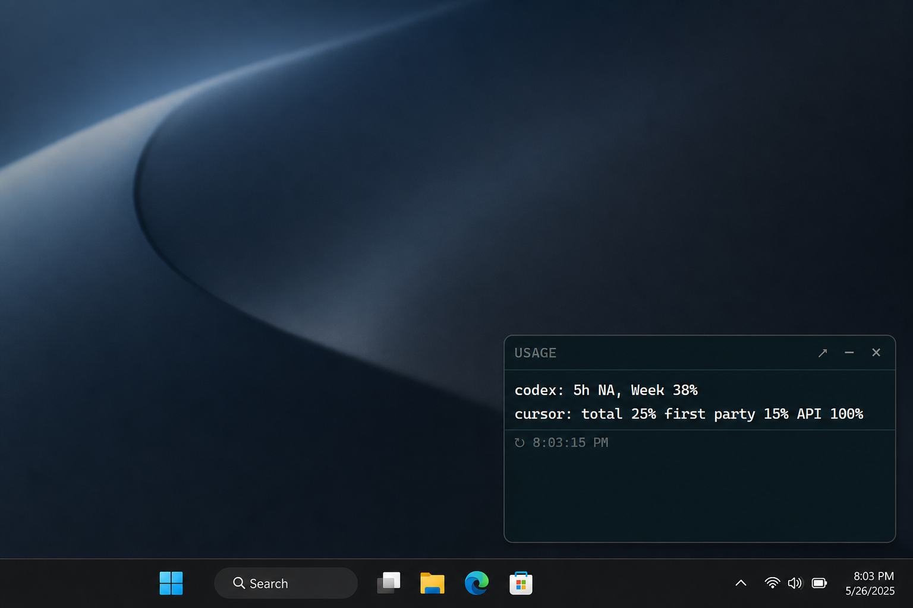

# Token Usage Widget

**See Codex + Cursor quotas in your corner — without opening five billing pages.**

Local always-on-top widget + browser dashboard for the AI harnesses you actually use. Runs on your machine (Windows and macOS). MIT. No account for this app.

[](./LICENSE)
[](https://nodejs.org)
[](#corner-widget)

**Repo:** [github.com/JYPersonal/token-usage-widget](https://github.com/JYPersonal/token-usage-widget)

---

## Why this exists

If you bounce between **Codex**, **Cursor**, and other harnesses, usage is scattered across dashboards, CLIs, and billing UIs. This puts the meters you care about in one place:

- **Corner widget** — always on top, tray / menu-bar icon, optional login Startup
- **Full dashboard** — `http://127.0.0.1:4321`
- **Only enabled providers** — you choose what to poll; the rest stay off

Secrets stay in a per-user `config.json` (not in the install tree). Default bind is localhost.

## Demo

<p align="center">
  
</p>

<p align="center"><em>Always-on-top Windows corner widget</em></p>

<p align="center">
  
</p>

<p align="center"><em>Local browser dashboard</em></p>

A macOS screenshot is **not** available for this release — the maintainer has no Mac, so real interactive Mac behavior is unverified. The compact UI is identical on macOS because both platforms share `public/widget.html`, `public/widget.css`, `public/widget.js`, and `public/widget-compact.js`. See [macOS](#macos) and the [evidence index](docs/macos-widget/evidence-index.md).

## Quick start (≈2 minutes)

```bash
npm i -g token-usage-widget   # first install downloads Electron (~100–150MB)
tuw setup --defaults          # OpenAI Codex + Cursor (local login)
tuw                           # corner widget (Windows or macOS)
```

Or open the full browser dashboard:

```bash
tuw start
# → http://127.0.0.1:4321
```

| Command | What it does |
| ------- | ------------ |
| `tuw` / `tuw widget` | Start the corner widget |
| `tuw setup` | Interactive provider setup |
| `tuw setup --defaults` | Enable OpenAI + Cursor only |
| `tuw start` | Dashboard server only |
| `tuw startup install` | Enable login Startup (platform-specific) |

**Requirements:** Node.js 18+ (CI uses 22). Windows or macOS 13+ (Intel or Apple Silicon) for the Electron widget. `sqlite3` on `PATH` helps Cursor (and some OpenCode fallbacks). No DMG/EXE signing or notarization — distribution is the npm package + Electron runtime.

Config lives under `%APPDATA%/token-usage-widget/config.json` (Windows) or `~/.config/token-usage-widget/config.json` (macOS/Linux). Override with `TOKEN_USAGE_WIDGET_CONFIG`. A one-time migrate copies a checkout `./config.json` into that location when missing.

Already logged into Codex CLI and Cursor desktop? `tuw setup --defaults` is usually enough.

### From source (contributors)

```bash
git clone https://github.com/JYPersonal/token-usage-widget.git
cd token-usage-widget
npm install
npm run build
npm run setup:defaults
npm run widget:bg
```

## Who it’s for

- Devs who hit **Codex week / 5h** or **Cursor API / first-party** limits mid-session
- People running **several** AI CLIs and wanting one glanceable HUD
- Anyone who wants **local-only** usage visibility (no SaaS signup for this tool)

## Features

|                   |                                                                                                                     |
| ----------------- | ------------------------------------------------------------------------------------------------------------------- |
| **Corner widget** | Frameless, always-on-top, bottom-right; auto-starts the local API; revives it if the server dies; persists size     |
| **Dashboard**     | Clean multi-provider meters with reset countdowns                                                                   |
| **Setup Q&A**     | `npm run setup` — enable providers, paste keys only when needed                                                     |
| **Fail-closed**   | Missing creds → clear unavailable/error, not fake percentages                                                       |
| **Auto-refresh**  | Every 60 seconds                                                                                                    |

## Providers

| Provider         | Auth                                           | What you see                      |
| ---------------- | ---------------------------------------------- | --------------------------------- |
| **OpenAI Codex** | Logged-in Codex CLI                            | 5h / week / month **remaining** % |
| **Cursor**       | Desktop login or `CURSOR_TOKEN`                | Total / first-party / API %       |
| **OpenCode Go**  | Browser `auth` cookie (usage API not live yet) | Rolling / week / month used %     |
| **Claude**       | Claude Code OAuth / `CLAUDE_ACCESS_TOKEN`      | 5h / week used %                  |
| **OpenRouter**   | API key                                        | Prepaid **USD** balance           |
| **Kimi Code**    | API key or local credentials                   | 5h / week used %                  |
| **Z.AI / GLM**   | API key                                        | Session / week used %             |
| **Grok Build**   | `grok login` or env token                      | Build credits (or period %)       |

> **Reliability today:** Codex + Cursor are the strongest paths. Other adapters fail closed when credentials or upstream APIs are missing — see [Limitations](#limitations).

### Setup commands

| Command                  | What it does                                     |
| ------------------------ | ------------------------------------------------ |
| `tuw setup` / `npm run setup` | Interactive: enable providers + optional secrets |
| `tuw setup --defaults` / `npm run setup:defaults` | Enable **OpenAI + Cursor** only                  |
| `npm run setup:all`      | Enable all provider flags (no secret prompts)    |

Or copy [`config.example.json`](./config.example.json) into your user config path (see Quick start).

Env vars override file secrets when set (`OPENROUTER_API_KEY`, `CLAUDE_ACCESS_TOKEN`, `OPENCODE_GO_AUTH_COOKIE`, …).

Cold start: every provider is **off** until setup (or you edit `providers` in config). Disabled providers are never polled.

### OpenCode Go note

Terminal API keys are tried against `GET /zen/go/v1/usage`, but that endpoint is **not live yet**. Live Go meters need a browser session cookie via setup / env / config. Helper: `node --import tsx scripts/save-opencode-cookie.ts`.

### Provider discovery on macOS

The Cursor and OpenCode adapters discover standard macOS locations when explicit inputs are absent. Explicit inputs always take priority over discovered defaults.

- **Cursor** state database defaults to `~/Library/Application Support/Cursor/User/globalStorage/state.vscdb` on macOS and `%APPDATA%/Cursor/User/globalStorage/state.vscdb` on Windows. `CURSOR_TOKEN` / `CURSOR_STATE_DB` overrides remain highest priority.
- **OpenCode Go** Firefox profile root defaults to `~/Library/Application Support/Firefox/Profiles` on macOS. Cookie / workspace resolution order is unchanged from Windows.
- **Honest unavailable:** missing credentials stay `unavailable`/error — no synthetic live usage. `OPENCODE_ALLOW_LOCAL_ESTIMATE=1` is the only opt-in estimate path.
- Safari, Chrome, and Arc cookie extraction is **not** supported.

## Corner widget

```bash
npm run widget:bg               # detached — normal use (Windows + macOS)
npm run widget                  # attached — debug
npm run widget:startup          # Windows Startup shortcut / macOS LaunchAgent
npm run widget:startup:disable  # remove login launch (preserves config)
npm run widget:status           # inspect login-launch status
```

Frameless, always-on-top, bottom-right of the work area. Starts the local API if needed and revives it if it dies. On Windows the widget lives in the system tray; on macOS it lives in the menu bar with no Dock icon. Tray/menu: show / hide / quit / open full dashboard.

If the configured `server.port` is already taken by an unrelated listener or a fixture-mode mismatch, the widget picks a free loopback port and both the widget and the dashboard use that same returned endpoint. The unrelated listener is left alive. The configured port in `config.json` is never rewritten.

**Never** leave `USAGE_FIXTURE=1` set for normal use (demo data only). Product launches strip fixture mode unless you pass Electron `--fixture` on purpose.

### Windows

`npm run widget:startup` installs a Windows Startup shortcut and launches. Native window close hides the widget (tray restore); custom × and menu Quit exit.

### macOS

macOS 13+ on Intel and Apple Silicon. First release runs from a source checkout with dependencies installed — there is no packaged app, DMG, signing, or notarization.

- **Menu bar, no Dock:** template icon; `app.dock.hide()` keeps it out of the Dock.
- **Active display:** anchors to the bottom-right of the work area on the display nearest the pointer; reanchors on show / display changes.
- **Spaces and full-screen:** visible on all normal Spaces; does not overlay full-screen apps.
- **Hide and quit:** hide restores from the menu bar; custom ×, native close, menu Quit, and Command-Q converge on one quit path that stops only an owned usage-server child.
- **Login launch:** successful setup modes install or refresh a per-user LaunchAgent. `widget:startup` / `widget:startup:disable` / `widget:status` manage it without deleting `config.json`.

**Automated verification vs. real-Mac observation:** CI passes `npm run verify` on Windows, macOS Intel, and Apple Silicon runners. Real interactive menu-bar, Spaces, full-screen, login-session, and live local Cursor/Firefox discovery on macOS hardware is **unverified** — the maintainer has no Mac. See the [evidence index](docs/macos-widget/evidence-index.md).

## Dashboard & API

```bash
npm run dev    # watch
npm start      # one-shot → http://127.0.0.1:4321
```

- `GET /api/health` → `{ status, fixture, time }`
- `GET /api/usage` → `{ fetchedAt, fixture, providers[] }`

Only **enabled** providers appear. Cursor may include `billing`; OpenRouter / Grok may include `balance`.

## Configuration

See [`config.example.json`](./config.example.json):

- `providers.<id>` — `true` to poll and show
- Provider secrets under `opencode` / `openrouter` / `kimi` / `zai` / `grok` / `claude`
- `server.host` / `server.port` (`PORT` env overrides)

`config.json` is **gitignored**. Do not commit secrets.

## Verify

```bash
npm run typecheck
npm test
npm run verify
```

Fixture demo (all eight providers):

```powershell
$env:USAGE_FIXTURE='1'; $env:USAGE_FIXTURE_ALL='1'; npm start
```

## Project layout

```
token-usage-widget/
├── src/           # HTTP server, setup CLI, adapters, login launch
├── public/        # dashboard + widget UI
├── desktop/       # Electron + platform policy + server launch / revive
├── docs/          # demo screenshots + macOS evidence index
├── scripts/       # widget launch, e2e evidence
└── tests/
```

## Security

- Binds to **localhost** by default
- Adapters do not log tokens
- `config.json` is gitignored
- Treat undocumented provider endpoints as best-effort; rotate keys if you ever leak them

## Limitations

- **OpenCode Go** — no official usage API yet (cookie scrape)
- **Claude / Kimi / Z.AI / Grok** — community / undocumented endpoints; shapes can change
- **macOS real-hardware behavior is unverified** — CI covers automated paths; interactive Mac observations are skipped (see [evidence index](docs/macos-widget/evidence-index.md))
- **Source-checkout only** — no packaged app, DMG, signing, or notarization
- **No Safari/Chrome/Arc cookie extraction** — Firefox only for OpenCode Go discovery
- **No Linux widget support**
- Not a hosted SaaS — you run it locally

## Contributing

Issues and PRs welcome. Please:

1. Run `npm run verify` before opening a PR
2. Keep secrets out of the repo
3. Prefer fail-closed (`unavailable` / clear error) over invented percentages

## License

[MIT](./LICENSE) © 2026
