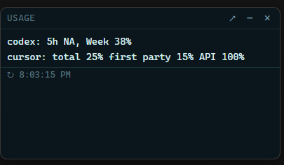
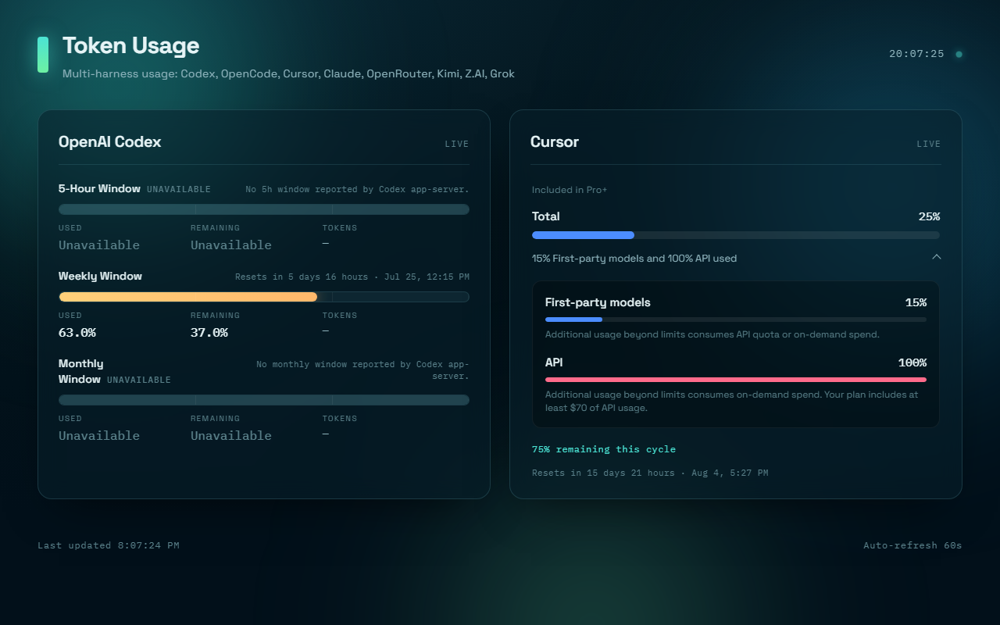

# Token Usage Dashboard

Local **dashboard** and **corner widget** for Windows and macOS that show how much of your AI harness quotas you’ve used — only for the providers you enable.

Supports: **OpenAI Codex**, **OpenCode Go**, **Cursor**, **Claude**, **OpenRouter**, **Kimi Code**, **Z.AI / GLM**, and **Grok Build**.

> Early public beta. Codex and Cursor are the most reliable paths today. Other adapters fail closed when credentials or upstream APIs are missing. See [Limitations](#limitations).

## Demo

Windows corner widget (always-on-top):



A macOS screenshot is **not** available for this release — the maintainer has no Mac, so real interactive Mac behavior is unverified. The compact UI is identical on macOS because both platforms share `public/widget.html`, `public/widget.css`, `public/widget.js`, and `public/widget-compact.js`, plus the 320 × 172 / 16 px margin geometry from `desktop/platform-policy.cjs`. See [macOS widget](#macos) and the [evidence index](docs/macos-widget/evidence-index.md).

Browser dashboard at `http://127.0.0.1:4321`:



## Features

- Compact always-on-top **corner widget** (Windows system tray; macOS menu-bar utility). Optional Windows Startup shortcut and automatic macOS login launch after setup.
- Full browser dashboard at `http://127.0.0.1:4321`
- Interactive **`npm run setup`** Q&A — pick providers, paste keys (or use env / local login files)
- **Only enabled providers are shown** (`config.json` → `providers`)
- Auto-refresh every 60 seconds
- Local-only by default (`127.0.0.1`); secrets stay in gitignored `config.json`

## Quick start

```bash
git clone <this-repo>
cd token-usage-dashboard
npm install
npm run setup          # enable the harnesses you use
npm run widget:bg      # corner widget, detached (Windows or macOS)
# or:
npm start              # then open http://127.0.0.1:4321
```

**Requirements:** Node.js 18+ (CI uses 22). Windows or macOS 13+ (Intel or Apple Silicon) for the Electron widget. `sqlite3` on `PATH` helps Cursor (and some OpenCode fallbacks) read local DBs. Distribution is source-checkout only — no packaged app, DMG, signing, or notarization is provided.

## Setup

| Command | What it does |
| -------- | ------------- |
| `npm run setup` | Interactive Q&A: enable/disable each provider; optional secrets |
| `npm run setup:defaults` | Enable **OpenAI + Cursor** only (local login; no prompts) |
| `npm run setup:all` | Enable **all** provider flags (no secret prompts) |

Or copy the example and edit:

```bash
cp config.example.json config.json
```

Environment variables override file secrets when set (e.g. `OPENROUTER_API_KEY`, `CLAUDE_ACCESS_TOKEN`, `OPENCODE_GO_AUTH_COOKIE`).

Cold start: every provider is **off** until you run setup or set `providers` in `config.json`. Disabled providers are never polled or displayed.

## Providers

| Provider | How you authenticate | What you see |
| -------- | -------------------- | ------------ |
| **OpenAI Codex** | Logged-in Codex CLI (`codex-status-mcp`) | 5h / week / month **remaining** % |
| **Cursor** | Cursor desktop login (`state.vscdb`) or `CURSOR_TOKEN` | Billing cycle: total / first-party / API % |
| **OpenCode Go** | Website `auth` cookie (+ workspace id) until a usage API ships | Rolling / week / month **used** % |
| **Claude** | Claude Code OAuth file or `CLAUDE_ACCESS_TOKEN` | 5h / week used % |
| **OpenRouter** | Credits / management API key | Prepaid **USD** balance |
| **Kimi Code** | `KIMI_CODE_API_KEY` or `~/.kimi/credentials/…` | 5h / week used % |
| **Z.AI / GLM** | `ZAI_API_KEY` / `GLM_API_KEY` | Session / week used % |
| **Grok Build** | `grok login` → `~/.grok/auth.json` or env token | Build credits (or period %) |

### OpenCode Go

Your terminal API key is tried against `GET /zen/go/v1/usage`, but that endpoint is **not live yet**. Until OpenCode ships it, live Go plan meters need a browser session cookie:

1. Open your Go workspace page and sign in  
2. DevTools → Application → Cookies → `auth`  
3. Save via `npm run setup`, or `OPENCODE_GO_AUTH_COOKIE`, or `config.json` → `opencode.go.authCookie`

Helper: `node --import tsx scripts/save-opencode-cookie.ts` (see script header).

### Provider discovery on macOS

The Cursor and OpenCode adapters discover standard macOS locations when explicit inputs are absent. Explicit inputs always take priority over discovered defaults; ordering among explicit mechanisms is preserved.

- **Cursor** state database defaults to `~/Library/Application Support/Cursor/User/globalStorage/state.vscdb` on macOS and `%APPDATA%/Cursor/User/globalStorage/state.vscdb` on Windows. `CURSOR_TOKEN` bypasses state-database token discovery. `CURSOR_STATE_DB` overrides the discovered database path.
- **OpenCode Go** Firefox profile root defaults to `~/Library/Application Support/Firefox/Profiles` on macOS and the existing Windows profiles root. Workspace resolution order is preserved: configured workspace ID → `OPENCODE_GO_WORKSPACE_ID` → plugin config → log discovery. Cookie resolution order is preserved: configured cookie → `OPENCODE_GO_AUTH_COOKIE` → plugin config → `OPENCODE_GO_AUTH_COOKIE_FILE` → Firefox discovery.
- **Honest unavailable:** when credentials are missing, adapters return the existing `unavailable`/error state — no synthetic usage is presented as live. `OPENCODE_ALLOW_LOCAL_ESTIMATE=1` is the only opt-in local-estimate route and is always labeled as an estimate, never as live plan usage.
- Safari, Chrome, and Arc cookie extraction is **not** supported.

## Corner widget

```bash
npm run widget:bg       # detached — normal use (Windows + macOS)
npm run widget          # attached — debug
npm run widget:startup  # Windows: install Startup shortcut + launch
                        # macOS: install/refresh per-user LaunchAgent
npm run widget:startup:disable  # macOS: remove the LaunchAgent
npm run widget:status   # macOS: inspect LaunchAgent status
```

Frameless, always-on-top, bottom-right of the work area. Starts the local API if needed. On Windows the widget lives in the system tray; on macOS it lives in the menu bar with no Dock icon. Tray/menu: show / hide / quit / open full dashboard.

If the configured `server.port` is already taken by an unrelated listener or a fixture-mode mismatch, the widget picks a free loopback port and both the widget and the dashboard use that same returned endpoint. The unrelated listener is left alive. The configured port in `config.json` is never rewritten.

**Never** leave `USAGE_FIXTURE=1` set for normal use (that is demo data). Product launches strip fixture mode unless you pass Electron `--fixture` on purpose.

### Windows

`npm run widget:startup` installs a Windows Startup shortcut and launches. Native window close hides the widget (tray restore); the custom × and menu Quit exit.

### macOS

macOS 13+ on Intel and Apple Silicon. First release runs from a source checkout with dependencies installed — there is no packaged app, DMG, signing, or notarization.

- **Menu bar, no Dock:** template icon with 1×/2× light/dark representations; `app.dock.hide()` keeps it out of the Dock.
- **Active display:** the widget anchors to the bottom-right of the work area on the display nearest the pointer and reanchors when shown again after the pointer moves or when display geometry changes.
- **Spaces and full-screen:** visible on all normal Spaces; `visibleOnFullScreen: false` so it does not overlay another app in full-screen mode.
- **Hide and quit:** the renderer hide control hides the widget and the menu bar restores it. Custom ×, native close, menu Quit, and Command-Q all converge on one quit path that terminates only the usage-server child owned by this widget. Because the LaunchAgent uses `KeepAlive=false`, an intentional quit stays quit until manual launch or the next login.
- **Login launch:** on macOS, every successful setup mode (`npm run setup`, `setup:defaults`, `setup:all`) installs or refreshes a per-user LaunchAgent at `~/Library/LaunchAgents/` after configuration saves successfully. `npm run widget:startup` installs or refreshes it idempotently; `npm run widget:startup:disable` removes it without touching `config.json`, environment variables, or provider credential files. `npm run widget:status` reports current status. If configuration saves but registration fails, setup preserves the saved config, exits nonzero, states that startup was not enabled, and prints `npm run widget:startup` as the retry command. A pre-save failure performs no registration.
- **Source-checkout launch:** `npm run widget:bg` resolves the current checkout, the local Electron under `<checkout>/node_modules`, the absolute Node executable, and the checkout CWD. It does not depend on `.exe`, NVM4W, `where.exe`, or a globally installed Electron.

**Automated verification vs. real-Mac observation:** CI (run [29726419443](https://github.com/JYPersonal/token-usage-widget/actions/runs/29726419443), commit `121a656`) passes `npm run verify` on `windows-latest`, `macos-15-intel`, and `macos-15` (Apple Silicon). It covers typecheck, the unit/integration suite, fixture Electron smoke, dynamic-port fallback logic, launch resolution, login-launch install/refresh/remove, setup registration, and Darwin Cursor/Firefox path resolution. Real interactive menu-bar, Spaces, full-screen, login-session, and live local Cursor/Firefox discovery behavior on macOS hardware is **unverified** — the maintainer has no Mac. See the [evidence index](docs/macos-widget/evidence-index.md) for the full claim-to-evidence map and the parity table.

## Dashboard server

```bash
npm run dev    # watch mode
npm start      # one-shot
```

Open [http://127.0.0.1:4321](http://127.0.0.1:4321).

### HTTP API

**`GET /api/health`** — `{ status, fixture, time }`

**`GET /api/usage`** — `{ fetchedAt, fixture, providers[] }`

Each provider includes `windows` (`five_hour` / `week` / `month`). Cursor may add `billing`; OpenRouter / Grok may add `balance`. Only **enabled** providers appear in the array.

## Configuration

See [`config.example.json`](./config.example.json). Important keys:

- `providers.<id>` — `true` to poll and display  
- `opencode.go.workspaceId` / `authCookie` — OpenCode Go scrape  
- `openrouter.apiKey`, `kimi.apiKey`, `zai.apiKey`, `grok.oauthToken`, `claude.accessToken`  
- `server.host` / `server.port` (`PORT` env overrides port)

`config.json` is **gitignored**. Do not commit secrets.

## Verify

```bash
npm run typecheck
npm test
npm run verify
```

Fixture demos with all eight providers:

```bash
# Unix
USAGE_FIXTURE=1 USAGE_FIXTURE_ALL=1 npm start

# PowerShell
$env:USAGE_FIXTURE='1'; $env:USAGE_FIXTURE_ALL='1'; npm start
```

## Project layout

```
token-usage-dashboard/
├── src/
│   ├── server.ts              # HTTP + static UI
│   ├── cli/setup.ts           # setup Q&A
│   ├── providers/registry.ts  # enable → fetch
│   └── adapters/              # per-provider fetchers
├── public/                    # dashboard + widget HTML/JS/CSS
├── desktop/                   # Electron main / preload / server launch
├── scripts/                   # widget launch, e2e evidence, cookie helper
└── tests/
```

## Security

- Binds to **localhost** by default  
- Tokens are not logged by adapters  
- `config.json` is ignored by git  
- Treat undocumented provider endpoints as **best-effort**; rotate keys if you ever commit them by mistake  

## Limitations

- **OpenCode Go** has no official usage API yet (cookie scrape only)
- **Claude / Kimi / Z.AI / Grok** use community or undocumented endpoints — shapes can change
- **macOS real-hardware behavior is unverified.** CI passes on `macos-15-intel` and `macos-15` (Apple Silicon), but the maintainer has no Mac, so interactive menu-bar/Spaces/full-screen/login-session behavior and live local Cursor/Firefox discovery on macOS hardware are not observed. See the [evidence index](docs/macos-widget/evidence-index.md).
- **Source-checkout release only.** No packaged app, DMG, signing, or notarization is provided.
- **No Safari, Chrome, or Arc cookie extraction.** Only Firefox is supported for OpenCode Go cookie discovery.
- **No Linux support.** The widget targets Windows and macOS only.
- **No synthetic data as live.** Fixture mode is demo data only; live provider data is never fabricated.
- Not a hosted SaaS; you run it locally

## Contributing

Issues and PRs welcome. Please:

1. Run `npm run verify` before opening a PR  
2. Keep secrets out of the repo  
3. Prefer fail-closed (`unavailable` / clear error) over invented percentages  

## License

[MIT](./LICENSE) © 2026 token-usage-dashboard contributors
